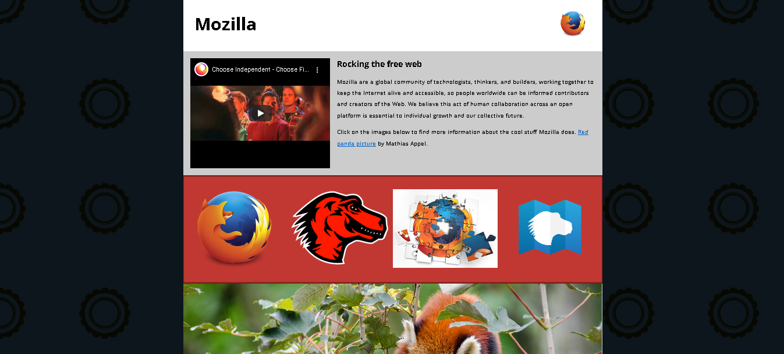

# Test skills - Multimidia and embedding - MDN WEB DOCS :memo:

Este teste foi retirado do curso Lern web development do MDN Web Docs, que possui vários artigos e desafios sobre desenvolvimentos web. Para saber mais, Acesse o curso [Learn Web Development](https://developer.mozilla.org/en-US/docs/Learn).

No capítulo sobre [multimidia and embedding](https://developer.mozilla.org/en-US/docs/Learn/HTML/Multimedia_and_embedding) é discutido formas de se inserir os mais diversos tipos de mídia em arquivo HTML, tais como:

- Imagens
- Vídeos
- áudios
- outros documentos HTML ( através do elemento  `<iframe>`)
- Uso de imagens responsivas

## Objetivo do teste :rocket:

O teste consiste em ser capaz de aplicacar as funcionalidades abordadas no capítulo . Toda a estrutura HTML e CSS já está montada ,  sendo necessário inserir o conteúdo multimídia do site. Para saber mais sobre o teste , acesse [Assesment Mozilla splash page](https://developer.mozilla.org/en-US/docs/Learn/HTML/Multimedia_and_embedding/Mozilla_splash_page).

## Tecnologias

Para esta tarefa foram utilizadas as seguintes ferramentas:

 
 
  
  
  
  

## Resultado 

 

